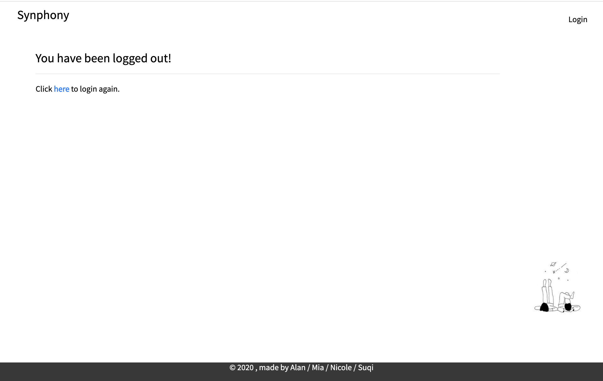
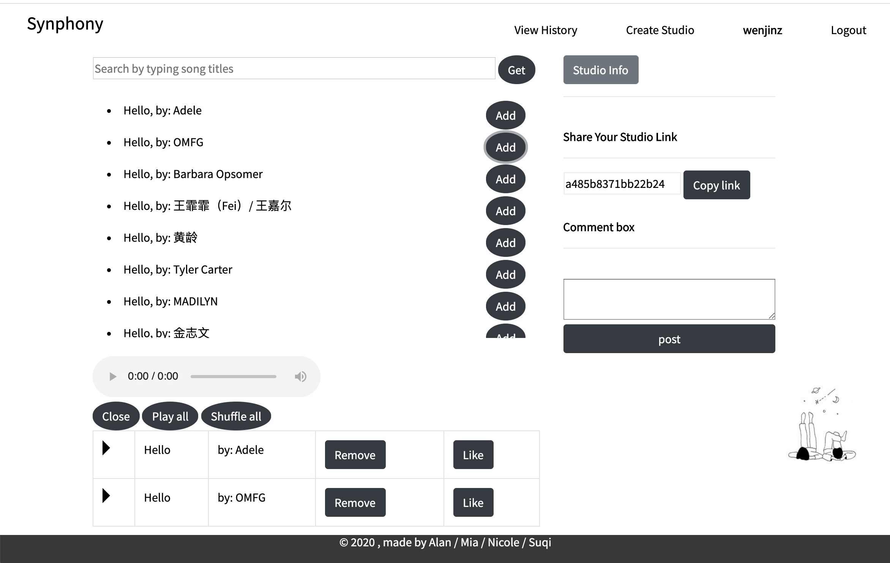

# Introduction

Synphony is a real-time music sharing web application. The word is made up of the idea to "**Syn**chronize your sym**phony**)". Whenever lovers, friends, co-workers, or families <u>hope to listen to music in synchronization</u>, Synphony is the right product to use.

A user of Synphony can:

* listen to other people’s music in real-time in his/her studio
* create a studio to share the music he/she is listening to with others in real-time
* chat with other participants within a studio

* view his/her historical activites

# Demo

1. ## Sign up/ Log in / Log out




2. ## Main Page

   After log in, we come to the main page.


3. ## Create a studio

Click "Create Studio" at top right nav bar, input our preferred studio name, click "Create".


4. ## Enter the studio you create

The studio we create takes on this look.


### 4.1 Search/Add/Remove Songs

Page look after we searched "Hello":


Page look after we click "Add":



Click the left triangle on each row to play the song. Or click "Play all", "Shuffle all" to play the whole playlist.


Click "Remove" to remove a song, and click "like" to like a song.

### 4.2 View Studio Info

Click the "Studio Info" button to uncollapse studio information.

For resource protection, every studio lasts for 2 hours, and we can see its living time and countdown.


### 4.3 Share your music in real-time (Main Feature!)

1. Click **copy link** under "Share Your Studio Link" on the right side.


2. Paste this link and send it to any person you want to share your studio. (In our case, `wenjinz` will  send `http://frozen-castle-16239.herokuapp.com/synphony/a485b8371bb22b24` to another user, `mia`)
3.  Suppose another user, (in our case, `mia`) is using Synphony. 


`mia` paste the link into the textbox and click 'Go to Studio'.


`mia`'s view of `wenjinz` 's studio:

<u>Click "start", `mia` will **livestream exactly the same music** as  `wenjinz` is currenly playing!</u> Any activities of `wenjinz` (i.e., add/remove songs, shuffle playing, change songs, pause, etc.) will be reflected in this studio.


### 4.4 Chat

`mia` and `wenjinz` can chat with each other using the "Comment box" on the right.


### 4.5 View personal activity histories

We can get our activities by clicking "View History".


# Try It Out

If you hate to sign up, feel free to try out with this public test account:

```
Username: mia
Password: mia12345678
```

